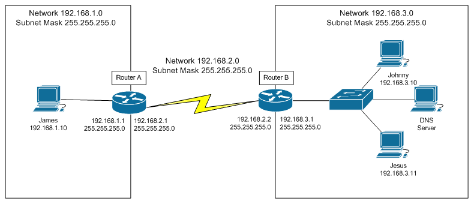

# Routing CISCO

```shell
Router(config)# ip routing
Router(config)# ip classless

Router(config)# ip route <siec_docelowa> <maska_sieci_docelowej> <interfejst_nastepnego_rutera_w_sieci_bezposrednio_podlaczonej_na_ktory_nalezy_wyslac_pakiet_do_sieci_(siec_docelowa)>

Router(config)# ip route <network> <mask> <gateway>

Router(config)# ip route 100.100.100.0 255.255.255.0 100.100.102.1

Router(config)# ip route 0.0.0.0 0.0.0.0 100.100.102.1
```

## Przykład

[Stack](https://serverfault.com/a/171552)



Aby połączyć się z `Router A` z `Johny`, w `B` ustawiamy: 

```shell
Router(config)# ip route 192.168.3.0 255.255.255.0 192.168.2.2
```

